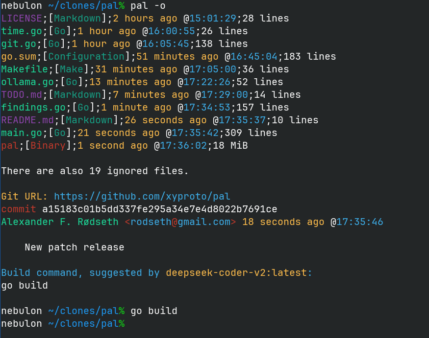

# Pal

This is a mix between git log, ls, a binary file detection utility, a file mode detection utility and a search utility.

The goal is to present the user with a palette of options for which action to perform in a given directory.

This is a work in progress.

### Screenshot

### Ollama and LLMs

* `export OLLAMA_MODEL=deepseek-r1:14b` to use the Deepseek R1 14B parameter model when using the `-o` flag.

### General info

* License: BSD-3
* Version: 0.2.5
